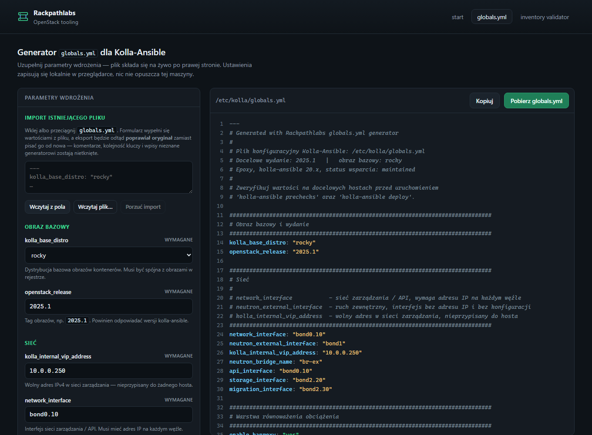
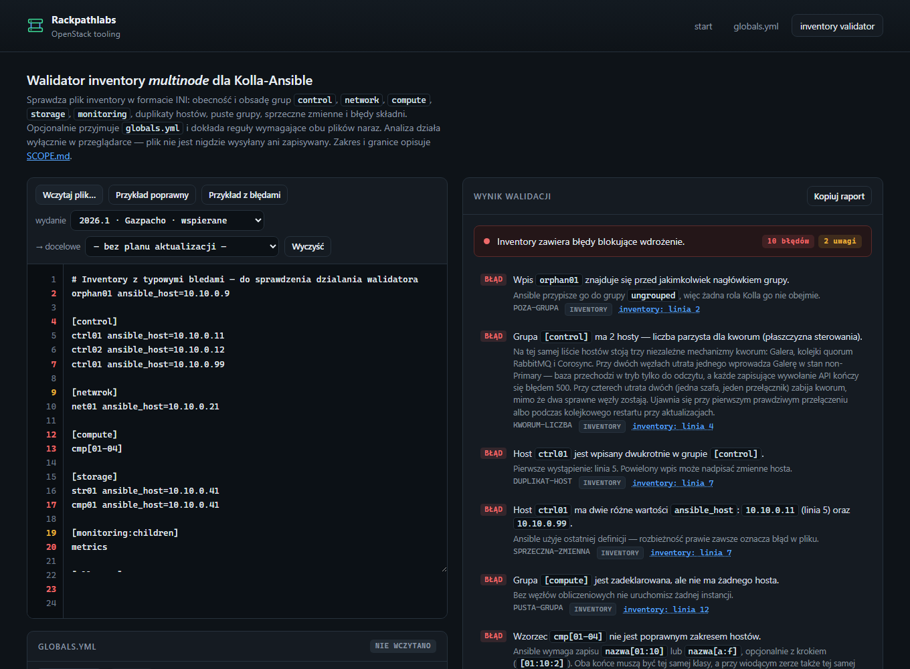

# kolla-tools

Two browser tools for Kolla-Ansible: one writes a `globals.yml`, the other reads a
multinode inventory. Both run entirely in your browser, as single HTML files.

**[rackpathlabs.github.io/kolla-tools](https://rackpathlabs.github.io/kolla-tools/)**

> The tool interfaces are in Polish. This README, [SCOPE.md](SCOPE.md) and the issue
> tracker are in English.

## The tools

### Generator — `globals.yml`

Fill in a form and get a `globals.yml` with comments explaining each decision. It checks
the file as you build it: release against base image, interfaces against each other,
internal TLS, endpoint naming, service dependencies, and the Octavia amphora network.

It also reads an existing file. On import the form fills in, unrecognised and deprecated
keys are reported, and export patches your original instead of rewriting it — comments,
key order and keys the generator knows nothing about survive untouched.



### Validator — inventory

Paste a multinode inventory and get a list of problems, each with a line number and a
description of what it will actually cause. It covers group structure and `:children`
expansion, host range patterns, duplicate hosts and addresses, quorum-sensitive group
sizes, role collocation, and group names renamed or removed in the release you select.

Findings carry a severity that reflects how certain the tool is. A configuration that
cannot be judged from the inventory alone gets a warning naming the missing evidence,
not an error.



## Two things nothing else does

**Combined mode.** Load a `globals.yml` alongside the inventory and the validator adds
the checks that need both files at once: Masakari enabled while the inventory carries no
BMC field anywhere, so fencing cannot exist; more than one storage host with no
`cinder_cluster_name`, which is not HA but N independent backends sharing one pool; a VIP
that is already some host's address. Collocated control and compute nodes also escalate
from warning to error, because the second file proves the condition that makes them
dangerous.

The second file is optional. Without it the validator behaves exactly as it does today,
and it does not lint the `globals.yml` itself — that is the generator's job, and the
interface says so where you load the file.

**Upgrade path mode.** Pick a target release and the validator reports what changed
between your current release and that target, restricted to things that are actually in
your files. A group you do not have cannot appear. Each item names the release it changed
in, the file and line in your own input, and what to do. Changes that no file edit can
fix — switching RabbitMQ queue type is the reference case — are marked as needing an
operational step instead.

Deprecations are catalogued per release from the kolla-ansible release notes. Some
releases have not been catalogued, and a path crossing one of them says so explicitly
rather than returning a short list that looks complete.

## Offline guarantee

Everything happens in your browser. No file is uploaded, nothing is stored on a server,
and the tools make no network requests at all — a Content-Security-Policy of
`default-src 'none'` blocks `fetch`, `XMLHttpRequest`, WebSockets and beacons, and CI
fails if that policy changes, if any outbound API appears in the code, or if any external
resource is referenced.

Each tool is one self-contained HTML file. Save it and it keeps working from `file://`,
offline, with no install and no dependencies.

These tools also do not check everything, and [SCOPE.md](SCOPE.md) says what they leave
out, where an answer is an inference rather than a fact, and what an empty result does and
does not prove. Reading it is worth the three minutes before you trust a clean run.

## Supported releases

The release matrix is one table consumed by both tools. "Deprecations catalogued" is what
the upgrade path mode relies on; where it says no, a path crossing that release warns
instead of staying silent.

| Release | kolla-ansible | Support status | Deprecations catalogued |
|---|---|---|---|
| 2026.2 Hibiscus | — | development | no |
| 2026.1 Gazpacho | 22.x | maintained | yes |
| 2025.2 Flamingo | 21.x | maintained | yes |
| 2025.1 Epoxy | 20.x | maintained | yes |
| 2024.2 Dalmatian | 19.x | end of life | yes |
| 2024.1 Caracal | 18.x | unmaintained | yes |
| 2023.2 Bobcat | 17.x | end of life | no |
| 2023.1 Antelope | 16.x | end of life | no |
| Zed | 15.x | end of life | no |
| Yoga | 14.x | end of life | no |

Base image distributions: `centos`, `debian`, `rocky`, `ubuntu`, validated per release.
Matrix data verified 2026-08-10 against `docs.openstack.org` and `releases.openstack.org`.

## Working on this repository

No npm, no build step, no dependencies. The published artefacts are the HTML files
themselves.

```
bash tools/run-tests.sh            # everything CI runs
bash tools/run-tests.sh --update   # regenerate golden files after an intended change
bash tools/sync-blocks.sh          # push shared blocks into the HTML files
```

Code shared between tools lives in `matrix.js`, `globals-parser.js` and `theme.css`, and
is pasted byte-identically into each file that needs it; CI fails if the copies drift.
Tests need only Node.

## Licence

MIT — see [LICENSE](LICENSE).
